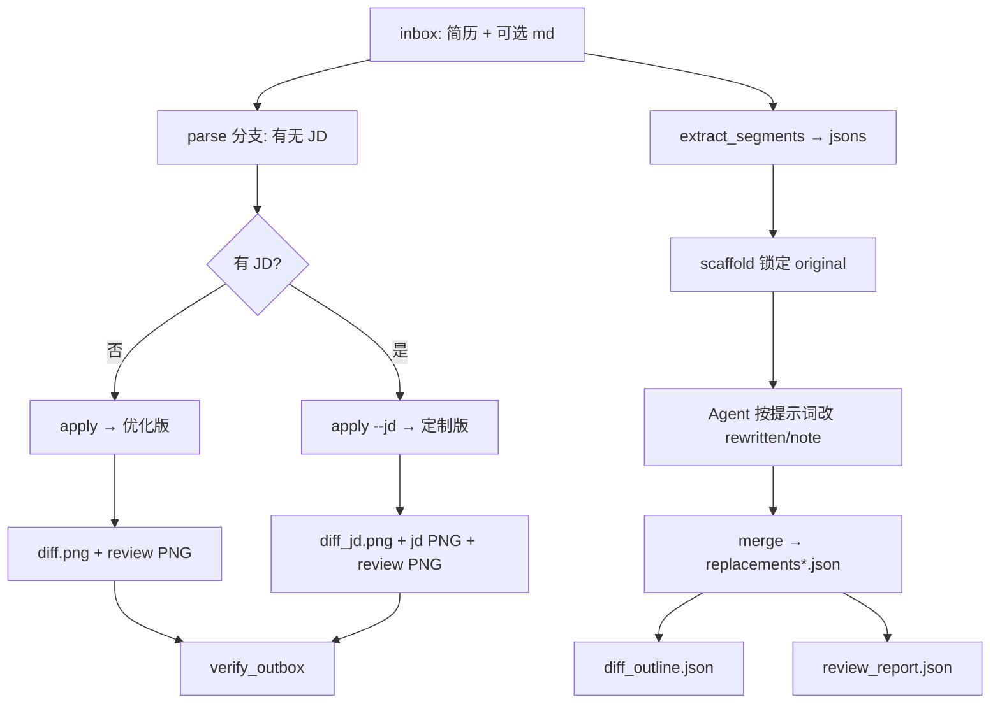
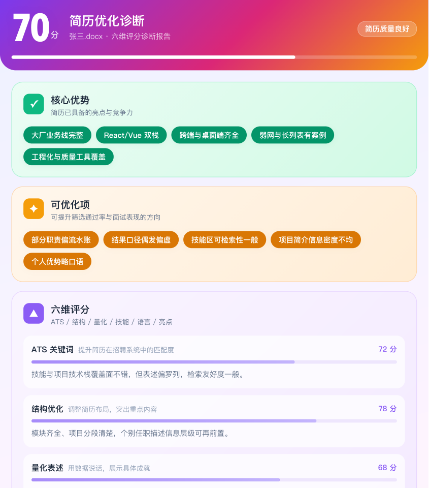
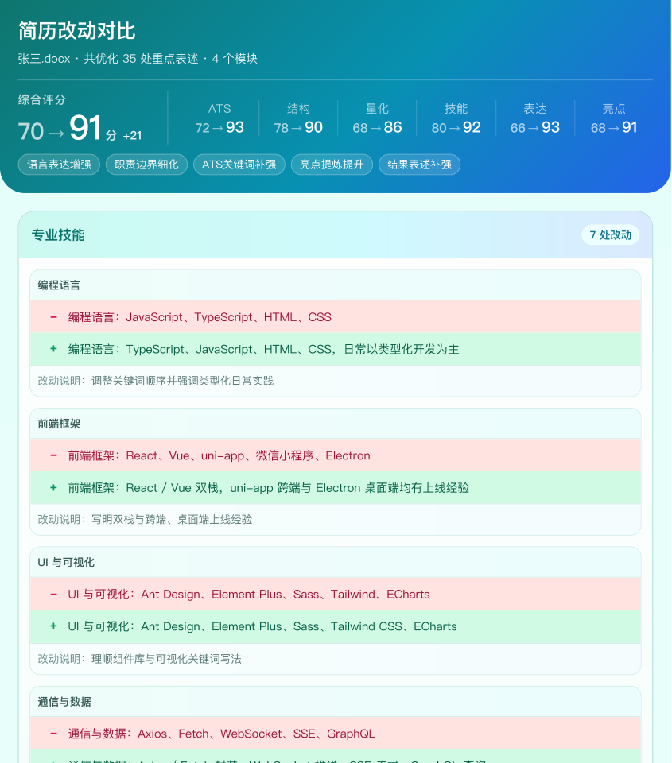
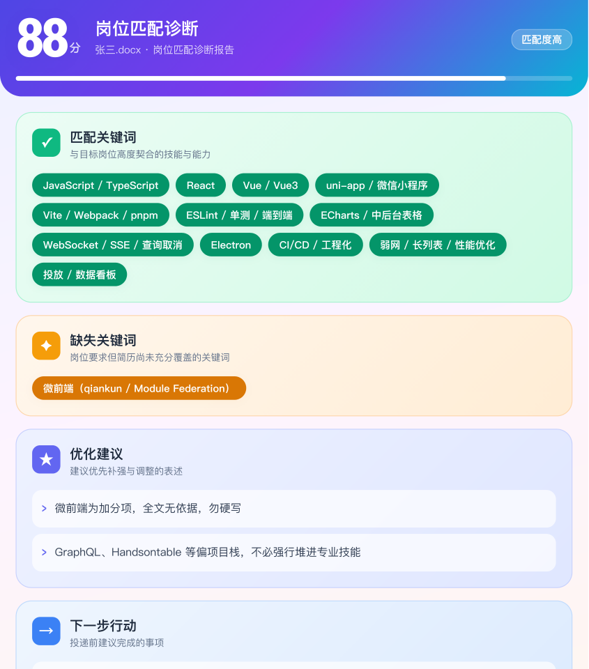

# AI 简历

用 **Cursor** 做「保版式」简历文案优化：在对话里说一句 **「简历优化」**（或 `/resume`），即可**自动跑通**抽段 → 智能改写 → 保样式回写 → 报告截图 → 验收。

- **改什么：** 职责、项目、技能、自我评价等文字  
- **不改什么：** 版式、字体、颜色、栏位结构（只改 `run` 文本）  
- **默认能力：** 提示词与规则**主打前端**；后端等其他岗位可复制 `prompts/` 自行扩展后接入同一套流程  

铁律：**不夸大、不编造**——只在原文依据内优化表述与结构；量化宁缺毋滥。

---

## 它解决什么问题

手工「润色简历」常见痛点：

| 痛点 | 本项目做法 |
|------|------------|
| 换模板等于重排版，原版式丢失 | 保原 Word/PDF 样式，只换文案 |
| 改写同质化、装资深、乱贴百分比 | 按年限档位对标「该档完美简历」；禁止浅改充数 |
| 改完不知道改了哪里、值不值 | 输出对比长图 + 诊断报告（可选岗位匹配报告） |
| 模型改串条、说明挂错段落 | scaffold/merge 锁定原文；验收脚本拦串改 |

适合：用 Cursor 优化自己的前端（或扩展后的其他岗位）简历；也可作为保版式改写流水线二次开发。

---

## 方案概览

### 职责拆分

| 层 | 谁做 | 做什么 |
|----|------|--------|
| 编排 | Cursor Agent + Skill | 读提示词、生成 JSON、按步骤调脚本 |
| 提示词 | `prompts/*.txt` | 改写口径、评分尺子、Diff 大纲、JD 匹配 |
| 管道 | `scripts/*.py` | 抽段、合并、回写、渲染 PNG、验收 |
| 模板 | `templates/*.html` | 报告视觉（Chrome 截图成 PNG） |

**模型不直接改 docx。** 模型只产出结构化 JSON；由脚本把改写安全写回原稿样式。

### 端到端流程



### 两条互斥分支

| 条件 | 分支 | 最终产出 |
|------|------|----------|
| 无 `<stem>.md`，或 JD 区块为空 | **通用优化** | 优化版简历 + 改动对比 + 优化诊断 |
| JD 区块非空 | **JD 定制** | 定制版简历 + JD 对比 + 岗位匹配 + 优化诊断 |

同一份简历单次运行**只走一条分支**（有 JD → 定制；无 JD → 通用），避免混淆。仓库官方示例 `张三` 为便于对比，**同时保留**两套完整产出。

---

## 示例效果

虚构示例「张三」产出截图（[`outbox/`](outbox/)）。三图并列：诊断、改动对比、岗位匹配。README 仅展示顶部预览（约 960px 高），点击可看完整长图。

<table>
  <tr>
    <td align="center" valign="top" width="33%">
      <p><b>优化诊断</b></p>
      <a href="outbox/张三_review_report.png"></a>
    </td>
    <td align="center" valign="top" width="33%">
      <p><b>改动对比</b></p>
      <a href="outbox/张三_diff.png"></a>
    </td>
    <td align="center" valign="top" width="33%">
      <p><b>岗位匹配</b></p>
      <a href="outbox/张三_jd_report.png"></a>
    </td>
  </tr>
</table>

对应终稿：[`张三_优化版.docx`](outbox/张三_优化版.docx)（通用）、[`张三_定制版.docx`](outbox/张三_定制版.docx)（JD）。预览图可用 `python scripts/make_readme_previews.py` 从完整 PNG 重新裁切。

---

## 环境要求

- [Cursor](https://cursor.com/)（加载仓库内 `.cursor/skills/`）
- Python 3.9+
- Google Chrome / Chromium（报告 PNG 自动截图；没有则只生成 HTML，需手动截图）

依赖见 [`requirements.txt`](requirements.txt)（主要是 `python-docx`、`pymupdf`）。

---

## 安装

需已安装 **Python 3.9+**。脚本会创建 `.venv` 并安装依赖（内部直接调用 venv 里的 pip，无需先手动 activate）。

**macOS / Linux：**

```bash
git clone <your-repo-url> && cd "AI Resume" && ./install.sh
```

已在仓库根目录时：

```bash
./install.sh
```

想装完后在当前终端立刻进入虚拟环境：

```bash
source ./install.sh
```

**Windows：**

```bat
git clone <your-repo-url> && cd "AI Resume" && install.bat
```

已在仓库根目录时（推荐双击或在 cmd 中）：

```bat
install.bat
```

或在 PowerShell 中：

```powershell
powershell -NoProfile -ExecutionPolicy Bypass -File .\install.ps1
```

安装成功后脚本会打印详细下一步（Cursor 打开仓库、放入简历、说「简历优化」等）。用 **Cursor 打开本仓库根目录**，即可加载 Skill。

## 快速使用（推荐）

1. 把简历放进 `inbox/`（仓库已带虚构示例 `inbox/张三.docx`，可直接说「简历优化」试用；也支持 `.pdf`，回写精度不如 Word）  
2. （可选）复制 [`inbox/_template.md`](inbox/_template.md) → `inbox/<姓名>.md`，或参考示例 [`inbox/张三.md`](inbox/张三.md)，粘贴目标 JD / 额外要求  
3. 在 Cursor 对话输入：

```text
简历优化
```

或使用命令 **`/resume`**。

Agent 会按 [`.cursor/skills/resume-optimize/SKILL.md`](.cursor/skills/resume-optimize/SKILL.md) **自动完成全流程**，并在结束后给出 `outbox/` 路径。多份未优化简历时会列出选项供你选择。官方示例同时提供通用与 JD 两套产出：`outbox/张三_优化版.docx`、`outbox/张三_定制版.docx` 及对应报告。

### 怎样算「未优化」

- 通用：缺 `outbox/<stem>_优化版.*` 或 `_diff.png` 或 `_review_report.png`  
- JD：缺 `_定制版.*` 或 `_diff_jd.png` 或 `_jd_report.png` 或 `_review_report.png`  

---

## 输入说明（inbox）

`<stem>` = 简历文件名去掉扩展名（`张三.docx` → `张三`）。配置 md **必须与简历同 stem**。

| 文件 | 必须 | 说明 |
|------|------|------|
| `<stem>.docx` / `<stem>.pdf` | 是 | 原简历；**不要覆盖原件**，优化稿写到 outbox |
| `<stem>.md` | 否 | JD + 额外要求 + 可选六维开关；无文件或 JD 留空 → 走通用分支 |
| [`_template.md`](inbox/_template.md) | 模板 | 复制改名使用（含六维默认全开） |
| [`张三.docx`](inbox/张三.docx) / [`张三.md`](inbox/张三.md) | 官方示例 | 虚构履历 + mock JD；`outbox` 同时含通用优化版与 JD 定制版全套报告 |

### 官方示例说明

`张三` 为**虚构履历样例**（非真实个人经历）：约五年前端；工作经历示例公司为国内互联网头部四家（字节跳动、阿里巴巴、腾讯、百度）。**版式**：对齐两页母版槽位。项目块五段（青柠闪送 / 仓脉 / 星轨投放 / 云工单 / 学知堂；主栈 uni-app / Vue2 / React / Vue3 / Electron）。`inbox/张三.md` 含 mock JD（对话里跑优化默认走 JD 分支）。**示例产出双套齐全**：通用 `_优化版` + `_diff`；JD `_定制版` + `_diff_jd` + `_jd_report`；共用 `_review_report`。两套均完整时 `verify_outbox` 放宽互斥，便于对比演示。

### `<stem>.md` 区块

```markdown
## 职位描述（JD）
（粘贴目标岗位 JD。留空则只做通用润色。）

## 额外要求
（如：突出 React/Vue、强调工程化、勿夸大管理经验等。）

## 六维优化
（一般保持默认全开；仅明确不想强化某一维时改为 false。）
```

六维键名：`ats_keywords` / `structure` / `quantification` / `skill_matching` / `language` / `highlights`。完整示例见 [`inbox/_template.md`](inbox/_template.md)。无该段或无 md 时按默认全开。

解析命令：

```bash
python scripts/parse_inbox_config.py --stem "张三"
# → { "jd", "requirements", "has_jd", "dimensions", ... }
```

---

## 产出物说明

### 最终产出（outbox）

| 场景 | 文件 | 含义 |
|------|------|------|
| 通用 | `<stem>_优化版.docx`（或 `.pdf`） | 保样式回写后的优化简历 |
| 通用 | `<stem>_diff.png` | 改动对比长图：原文/改写、`note` 说明、顶部优化后评分 |
| 通用 | `<stem>_review_report.png` | **优化前**六维测评与可优化方向 |
| JD | `<stem>_定制版.docx`（或 `.pdf`） | 按 JD 定向改写后的简历 |
| JD | `<stem>_diff_jd.png` | 改动对比（与通用同一模板，仅文件名区分分支） |
| JD | `<stem>_jd_report.png` | 岗位匹配：匹配/缺失关键词、建议与下一步 |
| JD | `<stem>_review_report.png` | 同上，优化前测评（两分支都有） |

**通常无需外传：** 任何 `.json`、`.html`、中间 `.txt`/`.md`（HTML 仅供本地预览）。

### 内部预览（outbox，可选打开调样式）

| 文件 | 说明 |
|------|------|
| `_diff.html` / `_diff_jd.html` | 对比报告 HTML（截图源） |
| `_review_report.html` | 诊断报告 HTML |
| `_jd_report.html` | 岗位匹配 HTML（仅 JD） |

无 Chrome 时脚本会提示：用浏览器打开上述 HTML 自行截长图。

### 中间 JSON（jsons/，复跑与调试用）

| 文件 | 说明 |
|------|------|
| `_segments.json` | 抽段结果（含 `editable`） |
| `_replacements.scaffold.json` | 锁定 original 的骨架 |
| `_replacements.json` / `_replacements_jd.json` | 终稿改写表（含 `note`） |
| `_diff_outline.json` | Diff 章节层级大纲 |
| `_review_report.json` | 诊断评分数据 |
| `_jd_report.json` | 岗位匹配数据（仅 JD） |

`inbox` 里的个人简历、`outbox` / `jsons` 内容默认被 `.gitignore` 忽略，避免误提交隐私。

---

## 改写与质量标准（摘要）

完整铁律见 Skill；产出前请至少保证：

1. **不夸大、不编造**（最高优先级）  
2. 按 **0–2 / 3–5 / 6–9 / 10+** 档位写，不统一「十年口吻」  
3. **一次做透**表述与结构；不是补造经历  
4. 禁止无信息增益的浅改（只换「负责→主导」等）  
5. 技能区从全文（含项目技术栈）**有选择地**回填：只补热门主流前端 JD 常见词；冷门库留在项目技术栈即可；无依据不写入  
6. 量化：有机制才可保守估算并 note「请按实际数据核对调整」  
7. **通用文案原则**（提示词内）：背景与职责分工、每条回答「所以呢」、起句勿同质、无数字也可写可感知结果、优势写事实（非个人模板搬迁，为跨经历可复用沉淀）

防串条：必须先 `scaffold`，模型只改 `rewritten`/`note`，再 `merge`；**禁止改 `id`/`original`**。

验收：

```bash
python scripts/verify_outbox.py --stem "张三"       # 通用
python scripts/verify_outbox.py --stem "张三" --jd # JD
```

未 `[PASS]` 不宜视为流程完成。

---

## 提示词与扩展其他岗位

| 文件 | 用途 |
|------|------|
| [`prompts/copy_only_zh.txt`](prompts/copy_only_zh.txt) | 通用改写（当前前端口径） |
| [`prompts/frontend_jd_tailor_zh.txt`](prompts/frontend_jd_tailor_zh.txt) | JD 定制改写（前端） |
| [`prompts/resume_review_zh.txt`](prompts/resume_review_zh.txt) | 优化诊断评分 |
| [`prompts/diff_outline_zh.txt`](prompts/diff_outline_zh.txt) | Diff 层级大纲 |

**扩展其他岗位：** 新增例如 `prompts/backend_copy_zh.txt`，在 Skill 中把通用/JD 提示词路径改成对应文件即可；脚本管道不用改。

---

## 脚本一览

| 脚本 | 作用 |
|------|------|
| `parse_inbox_config.py` | 解析 `<stem>.md` |
| `extract_segments.py` | 抽段 → `jsons/` |
| `merge_replacements.py` | `scaffold` / `merge` / `set` |
| `apply_replacements.py` | 保样式回写 → `_优化版` 或 `_定制版` |
| `render_diff_report.py` | 对比 PNG |
| `render_review_report.py` | 诊断 PNG（原稿分） |
| `make_readme_previews.py` | 从完整报告 PNG 顶部裁切 README 预览图 |
| `render_jd_report.py` | 岗位匹配 PNG |
| `render_html_capture.py` | HTML→单页 PDF→PNG |
| `verify_content.py` / `verify_outbox.py` | 内容与产出验收 |
| `lib_docx.py` / `lib_pdf.py` / `lib_paths.py` | 核心库与路径约定 |

---

## 手动流水线（备查）

日常请用 Cursor 一句指令。若需逐步调试：

**通用：**

```bash
source .venv/bin/activate
python scripts/parse_inbox_config.py --stem "张三"
python scripts/extract_segments.py --input "inbox/张三.docx"
python scripts/merge_replacements.py scaffold -s "jsons/张三_segments.json" -o "jsons/张三_replacements.scaffold.json"
# → Agent：按 copy_only 生成 patch，再 merge；写 diff_outline、review_report
python scripts/merge_replacements.py merge -s "jsons/张三_segments.json" -p "jsons/张三_replacements.patch.json" -o "jsons/张三_replacements.json"
python scripts/apply_replacements.py -i "inbox/张三.docx" -r "jsons/张三_replacements.json" -s "jsons/张三_segments.json"
python scripts/render_diff_report.py -r "jsons/张三_replacements.json" --outline "jsons/张三_diff_outline.json" --review "jsons/张三_review_report.json"
python scripts/render_review_report.py -i "jsons/张三_review_report.json"
python scripts/verify_outbox.py --stem "张三"
```

**JD：** 使用 `frontend_jd_tailor` 与 `_replacements_jd.json`，`apply` 加 `--jd`，并渲染 `jd_report`；最后 `verify_outbox.py --stem "张三" --jd`。

---

## 限制与注意

- **优先 Word（.docx）**；PDF 抽段/回写仅尽力而为，复杂版式可能偏差  
- PNG 依赖本机 Chrome；截图使用 `--use-mock-keychain`（不改 HOME，避免钥匙串弹窗）；无 Chrome 时仅 HTML  
- 本仓库**不负责换模板/重排版**；需要换模板请另寻工具  
- 开源仓库勿提交含隐私的真实简历（已 ignore 个人 `inbox` 文件、`outbox/*`、`jsons/*`）

---

## 工作区结构

```text
AI Resume/
  inbox/                 # 原件 + 配置（个人稿默认不入库；张三示例入库）
  jsons/                 # 中间 JSON（不入库）
  outbox/                # 最终产出 + HTML 预览（个人稿不入库；张三示例入库）
  scripts/               # 管道脚本
  prompts/               # 提示词（默认前端）
  templates/             # 报告 HTML
  .cursor/skills/        # resume-optimize + /resume
  .cursor/rules/         # 文档同步规则
  plan.md                # 方案与演进（设计说明）
  README.md              # 本文件
  LICENSE                # MIT
  requirements.txt
```

更细的设计决策与演进见 [`plan.md`](plan.md)。

---

## 许可

MIT License，见 [LICENSE](LICENSE)。
