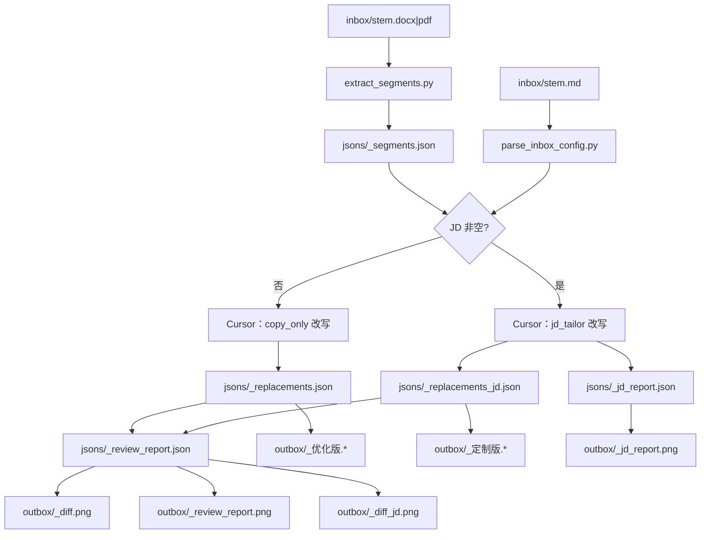

# AI 简历 — 方案与实施说明

> 本文记录项目定位、技术方案、产出约定与演进里程碑。  
> **日常使用说明以 [README.md](README.md) 为准**；二者冲突时以代码与 README 为准。

---

## 一、项目用途与定位

### 1.1 一句话

**AI 简历**：在 Cursor 中一句「简历优化」，自动完成保版式简历文案优化，并产出优化稿与说明型 PNG 报告。

### 1.2 适用场景

| 场景 | 用法 |
|------|------|
| 优化自己的简历 | 放入 inbox，对话触发，在 outbox 查看结果 |
| 二次开发 | 复用脚本管道，替换 `prompts/` 适配其他岗位 |

### 1.3 能力边界

| 做 | 不做 |
|----|------|
| 只改文案，保留原字体/加粗/版式 | 换模板、重排版、美化设计 |
| 通用润色 **或** JD 定制（互斥） | 同一次流程产出两套终稿 |
| 前端默认提示词 + 可扩展 | 开箱即用覆盖全部岗位（需自扩 prompts） |
| Cursor Agent 改写 + 本地脚本落地 | 自建模型 API（非必须） |

### 1.4 核心原则

1. **只改文案，不动版式**  
2. **Cursor 一句指令跑通全流程**（Skill 编排）  
3. **脚本不调用大模型**——只做抽段 / 合并 / 回写 / 渲染 / 验收  
4. **最终产出**为 docx/pdf/png；中间态不使用 json/html/txt/md 作为终稿  
5. **不夸大、不编造**；一次做透的是表述，不是虚构经历  
6. **默认主打前端**；其他岗位扩展提示词即可复用管道  

---

## 二、总体方案

### 2.1 架构分层

```text
┌─────────────────────────────────────────┐
│  Cursor Skill（resume-optimize）         │  编排、分支、调脚本、写 JSON
├─────────────────────────────────────────┤
│  prompts/                                │  改写 / 诊断 / 大纲 / JD 口径
├─────────────────────────────────────────┤
│  scripts/ + templates/                   │  抽段、回写、HTML→PNG、验收
├─────────────────────────────────────────┤
│  inbox → jsons → outbox                  │  输入 / 中间态 / 产出
└─────────────────────────────────────────┘
```

### 2.2 为什么「JSON + 本地渲染」

| 做法 | 问题 |
|------|------|
| 让模型直接输出整页 HTML | token 贵、样式不稳 |
| 让模型直接出图 | 贵且不可控 |
| **模型出紧凑 JSON + 本地 HTML 模板 + Chrome 截图** | token 省、样式可控、PNG 便于本地与常见通讯工具预览 |

### 2.3 端到端数据流



### 2.4 防串条设计（质量关键）

历史问题：整表按 id「凭记忆」改写时，`rewritten`/`note` 易挂到错误段落。

现行约定：

1. `merge_replacements.py scaffold`：从 segments 生成骨架，**锁死 original**  
2. 模型只输出对 `rewritten`/`note` 的修改（patch）  
3. `merge`：合并时 **original 一律以 segments 为准**  
4. 单条修改用 `set`，禁止手改整份 JSON 凭记忆填 id  
5. `verify_content` / `verify_outbox`：校验串改、note 相关性、diff HTML 一致性；失败则不应视为流程完成  

---

## 三、输入与产出约定

### 3.1 输入（inbox）

| 文件 | 必须 | 说明 |
|------|------|------|
| `<stem>.docx` / `<stem>.pdf` | 是 | 原简历；优先 docx |
| `<stem>.md` | 否 | `## 职位描述（JD）` + `## 额外要求` + 可选 `## 六维优化` |
| `_template.md` | 模板 | 复制为 `<stem>.md`（含六维默认全开） |

### 3.2 最终产出（outbox，互斥）

| 场景 | 产出物 | 含义 |
|------|--------|----------------|
| 无 JD | `_优化版` + `_diff.png` + `_review_report.png` | 改好的简历；改了哪里；原稿怎样 |
| 有 JD | `_定制版` + `_diff_jd.png` + `_jd_report.png` + `_review_report.png` | 按岗位改好的简历；改动；匹配度；原稿测评 |

### 3.3 报告分工

| 报告 | 展示重点 |
|------|----------|
| `_review_report` | **原稿**综合分与六维（`score_before`）；优势 / 可优化项 / 建议 / 下一步 |
| `_diff` / `_diff_jd` | **优化后**分与提升；层级对比 + 每条改动说明 |
| `_jd_report` | 匹配/缺失关键词（**全文含项目技术栈**）、弱项与下一步 |

### 3.4 中间产物（jsons/）

供 Agent 复跑与人工抽检，**非终稿**。包括 segments、replacements（及 scaffold/patch）、diff_outline、review_report、jd_report 等。

---

## 四、改写策略（提示词层）

### 4.1 档位

以工作经历推断年限，定档 junior / mid / senior / staff，**按该档完美简历**改写，禁止低年限装资深。

### 4.2 六维（默认全开）

ATS 关键词、结构（轻量调序）、量化、技能匹配、语言表达、亮点提炼。

### 4.3 评分口径

- 原稿常见约 58–72  
- 实质改写后优化后分常见约 88–94  
- 浅改不得虚高到 90+  

### 4.4 JD 匹配

- `matched` / `missing` 对比**全文**（技能 + 职责 + 简介 + **项目技术栈**）  
- 技能区未列但技术栈已有 → 记匹配；仅主流 JD 常见词才建议回填技能区，冷门库不必回填  
- 同技术不同写法由模型语义判断，无固定别名表  

### 4.5 通用文案原则

在改写/JD 提示词中沉淀可复用通则（非个人简历模板搬迁）：背景与职责分工、每条回答「所以呢」、起句勿同质、无精确数字也可写可感知结果、优势写事实。诊断提示词对时间线/技术矛盾、「精通」无印证、条条无结果等须在 weaknesses/suggestions 点出。

---

## 五、使用说明（与 README 对齐）

1. 运行 `./install.sh`（或 Windows 的 `install.bat`），用 Cursor 打开仓库  
2. 简历放入 `inbox/`，可选配置 `<stem>.md`  
3. 对话输入 **简历优化** 或 `/resume`  
4. 等待 Agent 跑完；确认 `verify_outbox` 通过  
5. 以 README「最终产出」列为准保留文件  

手动逐步命令、扩展其他岗位的方式见 [README.md](README.md)。

Skill 权威步骤：[`.cursor/skills/resume-optimize/SKILL.md`](.cursor/skills/resume-optimize/SKILL.md)。

---

## 六、关键决策记录

| 决策点 | 选择 | 原因 |
|--------|------|------|
| 触发 | 对话「简历优化」/ `/resume` | Automations 无法可靠监听本地 inbox |
| 模型入口 | Cursor Agent | 无需另配 API Key 即可开箱 |
| 报告形态 | PNG 长图 | 社交软件可直接预览 |
| 渲染 | HTML + Chrome headless | CSS 能力完整 |
| 配置 | 单文件 `<stem>.md` | 降低配置成本 |
| 通用 vs JD | 互斥 | 一次只交一套，避免困惑 |
| 结构优化 | 轻量 | 服从保版式定位 |
| 中间 JSON 目录 | `jsons/` | 与最终产出目录分离 |
| 简历文件名 | `_优化版` / `_定制版` | 文件名更直观 |

---

## 七、演进里程碑（合并后）

> 细碎 UI/文案迭代已折叠；实现细节以代码为准。

1. **脚手架与入口** — 抽段回写、Skill、六维、触发语  
2. **输入输出约定** — md 配置、互斥产出、验收与文档同步规则  
3. **报告渲染链路** — JSON→HTML→PNG；diff/jd/review 统一截图  
4. **Diff 体验** — GitHub 风格、模型大纲、note、顶部评分卡  
5. **改写与评分** — 分档、完美简历标准、不夸大不编造、评分展示分工  
6. **质量与防串条** — verify_content、merge_replacements  
7. **报告 UI 与文案** — 页头/卡片/副标题文案定稿  
8. **JD 匹配口径** — 全文含技术栈；技能回填只取主流 JD 常见词  
9. **产出目录与项目定型** — jsons/、中文简历文件名、开源、项目名「AI 简历」；`install.sh` / `install.bat`+`install.ps1` 一键装依赖  
10. **技能回填过滤冷门技术** — 项目栈不一律灌进专业技能；模型按热门前端 JD 判断是否回填，冷门库留在项目技术栈
11. **通用文案原则沉淀** — 从个人改简历实践中精选可复用通则写入 prompts（背景/职责分工、「所以呢」、起句勿同质、可感知结果、优势写事实）；诊断补证据/红旗意识；非整包移植个人模板  
12. **六维开关并入配置模板** — 删除 `optimization_defaults.yaml`；默认全开写入 `_template.md`「六维优化」段，由 `parse_inbox_config.py` 输出 `dimensions`  
13. **官方示例张三** — `inbox/张三.docx` + mock JD 的 `张三.md`；走 JD 定制分支；`outbox` 定制版 / diff_jd / jd_report / review 入库
14. **张三示例全文推倒重写** — 技能/任职/项目/优势全部新写，仅保留母版版式与行数槽位
15. **云工单单端 + 学知堂 Electron** — 云工单固定 Web 一端；学知堂 Electron 桌面端
16. **清理示例生成脚本** — 删除一次性 `build_sample_zhangsan.py`
17. **截图隔离兜底** — 仍用本机 Chrome 自动出 PNG；`--use-mock-keychain` + crash-dumps（不改 HOME，避免钥匙串弹窗）
18. **张三示例切 JD 分支** — md 写入 mock 资深前端 JD；产出定制版与岗位匹配报告
19. **张三示例双套并存** — 再补通用优化版；`verify_outbox` 在两套终稿均完整时放宽互斥，便于官方示例对比
20. **README 示例图** — 诊断 / 改动对比 / 岗位匹配三图并列；页头统一「简历改动对比」
21. **禁钥匙串弹窗** — 去掉假 HOME；加 `--use-mock-keychain` / `--password-store=basic`
22. **README 预览截断** — 诊断/岗位匹配用原图；改动对比预览截到首个 `.section-card`（含至少第一处改动）
---

## 八、已知问题与后续方向

### 已知问题

1. PDF 源回写不精确，复杂版式易偏差 → **优先使用 docx 源文件**  
2. PNG 依赖本机 Chrome；使用 mock keychain，不改 HOME，避免钥匙串弹窗；无 Chrome 时仅 HTML  
3. 对比/报告文件名仍有 `_diff` / `_review_report` 等英文后缀（简历文件名已中文化）  

### 后续可做

1. 报告视觉与信息密度按反馈迭代  
2. Skill 支持更顺畅的批量多份  
3. （已落地）`<stem>.md` / `_template.md` 的「六维优化」段覆盖单项开关  
4. （已落地）官方示例 `inbox/张三.*` + `outbox/张三_*`（虚构；mock JD；通用优化版与 JD 定制版双套示例）  
5. 按需提供 backend 等提示词包示例  

---

## 九、仓库文件清单

```text
AI Resume/
  inbox/                 # 原件 + 配置（个人稿默认不入库）
  jsons/                 # 中间 JSON
  outbox/                # 最终产出 + HTML 预览
  scripts/               # 管道与验收
  prompts/               # 提示词（默认前端）
  templates/             # 报告 HTML + favicon
  .cursor/skills/        # resume-optimize、resume
  .cursor/rules/         # sync-readme.mdc
  install.sh             # macOS/Linux 一键安装
  install.bat            # Windows 安装入口
  install.ps1            # Windows PowerShell 安装逻辑
  README.md              # 使用说明书
  plan.md                # 本文件
  LICENSE                # MIT
  requirements.txt
```

---

## 十、文档维护

变动输入/输出命名、脚本、提示词、分支逻辑、产出清单或 Skill 步骤时，须同步更新：

1. `README.md`  
2. 本文件 `plan.md`（在「演进里程碑」追加要点，并核验「最终方案」相关章节）  

规则文件：`.cursor/rules/sync-readme.mdc`。
