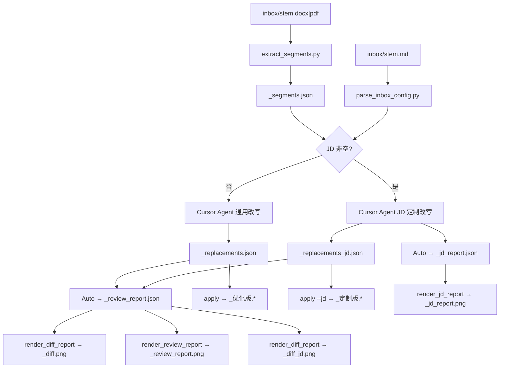

# 项目策划与实施全记录

> 记录日期：2026-07-29
> 目的：复盘方案演进过程，便于后续优化迭代

---

## 一、项目背景与定位

### 项目定位

面向前端候选人的**保原样式简历优化**：只改文案、不动版式；按工作年限对标该档完美简历；支持通用润色与 JD 定制（互斥）。

| 项 | 说明 |
|------|------|
| 工具 | Cursor Agent + 前端专用提示词 |
| 入口 | Cursor 对话「简历优化」或 `/resume` |
| 脚本 | 抽段 / 保样式回写 / 报告渲染 / 验收 |

### 核心原则

1. 只改文案，不动版式
2. 改写由 Cursor Agent 完成，脚本不调用大模型 API
3. 脚本只做抽段/回写/渲染/验收
4. 客户交付常见办公格式（docx/pdf/png），不发 txt/md/json/html
5. 铁律：不夸大、不编造

---

## 二、方案演进时间线

### 阶段 1：基础脚手架

**目标：** 搭建 inbox/outbox 结构，实现 Word 抽段与保样式回写。

**落地产物：**

- `scripts/extract_segments.py` — 从 `.docx`/`.pdf` 抽段 → `_segments.json`
- `scripts/apply_replacements.py` — 回写优化稿（只改 `run.text`，保留字体/加粗等样式）
- `scripts/lib_docx.py` — Word 保样式回写核心逻辑
- `scripts/lib_pdf.py` — PDF 抽段 + 尽力回写（非像素级）
- `prompts/copy_only_zh.txt` — 前端通用润色提示词（STAR、量化、技术准确）
- `prompts/frontend_jd_tailor_zh.txt` — JD 定制改写提示词
- `.cursor/skills/resume-optimize/SKILL.md` — Cursor Skill SOP
- `requirements.txt`（python-docx, pymupdf）、`.venv` 环境

### 阶段 2：触发与六维优化

**关键决策：**

- 触发语锁定为 **「简历优化」**
- 优化维度定为六维（ATS 关键词、结构优化、量化、技能匹配、语言表达、亮点提炼），默认全开
- 结构优化为**轻量**模式：bullet/字段顺序微调，不大改原稿版式
- Cursor Agentmations 不能监听本地 inbox，不用 Automations 做主入口

**落地产物：**

- `inbox/optimization_defaults.yaml` — 六维默认开关配置

### 阶段 3：JD 匹配报告方案选型

**决策过程：**

| 方案 | 评估 | 结论 |
|------|------|------|
| LLM 输出整页 HTML → 转图 | token 消耗大 | 不采用 |
| LLM 直接生成图片 | 不适用/极贵 | 不采用 |
| **LLM 输出紧凑 JSON → 本地渲染 PNG** | **token 最省** | **采用** |

**锁定方案：**

```text
Cursor Agent 只输出 _jd_report.json（几百 token）
  → 本地脚本读取 JSON
  → 渲染为 750px 宽竖版长图
  → 交付 _jd_report.png
```

报告格式选 PNG 长图（非 PDF），因为闲鱼/微信可直接预览，像「诊断海报」。

### 阶段 4：输入收拢

**问题：** 输入文件过多（`*.jd.txt`、`jd.txt`、`*.requirements.txt`、`requirements.txt`），客户操作复杂。

**决策：** 将除原简历外的 txt 收拢为单一 `<stem>.md`，分区块统一编辑。

**关键选择：**

- 与简历同名 `inbox/<stem>.md`（多客户互不干扰）
- 六维开关仍用仓库默认 yaml，不并入 md

**废弃输入：** `*.jd.txt`、`jd.txt`、`*.requirements.txt`、`requirements.txt`

**落地产物：**

- `inbox/_template.md` — 配置模板（JD + 额外要求两区块）
- `scripts/parse_inbox_config.py` — 按 `## 职位描述（JD）` / `## 额外要求` 标题切块解析

### 阶段 5：输出精简 + 互斥规则

**问题：** outbox 产出了不必要的 `.txt`（`_optimized.txt`）和 `.md`（`_diff.md`），客户不方便查看。

**决策：**

1. outbox 不再落盘任何 `.txt` / `.md`
2. **通用版与 JD 版互斥** — 有 JD 只出 JD 版三件套，无 JD 只出通用版两件套

**脚本改动：**

- `apply_replacements.py` — 移除 `write_diff` 写 md、移除 `write_pdf_text_fallback` 落 txt；新增 `--jd` 参数控制输出文件名后缀
- 新增 `render_diff_pdf.py` — 从 replacements JSON 直接生成对照 PDF（PyMuPDF TextWriter + china-s 字体）

### 阶段 6：JD 报告渲染实现

**技术探索（经历三次方案切换）：**

1. 先尝试 HTML 模板 + PyMuPDF Story 渲染 → CSS 渐变/色彩支持差，出图几乎空白
2. 改用 PyMuPDF `insert_font` + `insert_text` → 字体名含空格报错、嵌入完整字体致 PDF 28MB
3. 改用 PyMuPDF 程序化绘制（Canvas 类直接画图） → 可行但样式调整繁琐、CSS 能力弱
4. **最终方案：HTML 模板 + Chrome headless 截图** → 完整 CSS 渐变/色彩/圆角支持，样式美观可控

**最终方案：**

- `templates/jd_report.html` — 完整带 CSS 的 HTML 模板（渐变头部、四色卡片、圆角标签等），模板变量用 `{{}}` 占位
- `render_jd_report.py` — 读取 JSON 填入 HTML 模板 → 输出填好数据的 HTML 文件 → 调用 Chrome headless 打印 PDF → PyMuPDF 将 PDF 转 PNG（含底部空白裁剪）
- 渲染链路：`_jd_report.json` → 填充 HTML → Chrome `--print-to-pdf` → PyMuPDF 转 PNG + 裁剪 → `_jd_report.png`
- 渐变头部（紫→青/紫→橙/紫→红，随分数档位变化）
- 绿/橙/靛/蓝四色卡片分别对应：核心优势、可优化项（review）/ 缺失关键词（jd）、六维评分（review）/ 优化建议（jd）、下一步行动
- 无页脚免责声明
- 若系统无 Chrome 则跳过自动截图，提示手动在浏览器中打开 HTML 截屏

### 阶段 7：对照 PDF 体积优化

**问题：** 对照 PDF 体积约 1.6MB，原因是 `china-s`（Droid Sans Fallback）整个字体被嵌入 PDF。

**解决：** 在 `render_diff_pdf.py` 保存前调用 `doc.subset_fonts()`，只嵌入实际用到的字符子集。

**效果：** 1.6MB → 16KB（降幅 99%）。

### 阶段 8：自动化验收

**落地产物：** `scripts/verify_outbox.py`

**功能：** 给定 `--stem` 和 `--jd`（是否 JD 分支），自动检查：

- 客户文件是否齐全（缺失报错）
- 互斥文件是否不存在（如 JD 分支不应有无后缀的 `_optimized.*`）
- outbox 内是否存在禁止的 `.txt` / `.md` 文件

用法：

```bash
python scripts/verify_outbox.py --stem "张三" --jd    # JD 分支
python scripts/verify_outbox.py --stem "张三"          # 通用分支
```

通过输出 `[PASS]`，失败输出 `[FAIL]` 并列出具体问题，退出码为 1。

### 阶段 9：文档同步规则

**问题：** 方案频繁迭代，README 容易与实现脱节。

**解决：** 创建 `.cursor/rules/sync-readme.mdc`（`alwaysApply: true`），方案变动时自动同步 README。

### 阶段 10：改动对照改为 HTML → PNG

**问题：** `render_diff_pdf.py` 用 PyMuPDF 固定字符宽度换行，中文展示易截断，长段落阅读体验差。

**决策：** 与 JD 报告一致，改为 HTML 模板 + Chrome headless 截图 → PNG 长图交付。

**落地产物：**

- `templates/diff_report.html` — 改动对照 HTML 模板（渐变头部、原文/改写双色卡片、`word-break` 防截断）
- `render_diff_report.py` — replacements JSON → 填充 HTML → Chrome 截图 → `_diff.png` / `_diff_jd.png`
- 客户交付由 `_diff.pdf` 改为 `_diff.png`；`_diff.html` 为内部中间产物

**效果：** 中文自动换行、样式与 JD 报告统一，闲鱼/微信可直接预览长图。

### 阶段 11：简历优化诊断报告

**需求：** 除改动对照外，增加市面主流标准的「简历优化建议报告」，与 JD 匹配报告互补。

**决策：**

- 通用版与 JD 版**均产出** `_review_report.png`（JD 版同时保留 `_jd_report.png`）
- 评估维度对齐仓库六维开关：ATS 关键词、结构、量化、技能匹配、语言、亮点
- HTML 样式复用 JD 报告四色卡片体系，新增六维进度条区块
- `verify_outbox.py` 将 `_review_report.*` 视为共享交付物，不参与通用/JD 互斥冲突判定

### 阶段 12：PNG 全页截图修复

**问题：** Chrome `--print-to-pdf` 默认分页会在 review/diff 长图中产生大量空白；固定 `@page` 高度又会裁切内容。

**解决：**

- 新增 `render_html_capture.py`：按内容估算高度，动态注入单页 `@page { size: 750px <h>px }`
- **不**给 `body` 设 `min-height`（否则渐变背景被拉高，形成假留白）
- 底部裁切按「均匀背景行」识别，而非只认纯白像素
- 三份报告脚本（diff / jd / review）统一走 `html_to_png()`

### 阶段 13：diff 对照改为紧凑 GitHub 风格

**问题：** 原 diff 卡片间距过大，长图过高、体积偏大；「长度变化超过 ±20%」提示对客户无价值。

**决策：** 改为 unified diff 样式（`-` 红 / `+` 绿），去掉长度警告；同步下调高度估算。

### 阶段 14：diff 按简历层级聚合

**问题：** `p-12` 等内部段落 ID 对客户不直观，且条目平铺无层级感。

**决策：**

- 读取 `_segments.json`，识别大类（专业技能 / 工作经历 / 项目经验…）与二级（公司 / 项目名）
- 输出「大类卡片 → 二级标题 → 易读标签对比行」
### 阶段 15：Diff 层级改由模型识别

**决策：**

- 新增 `prompts/diff_outline_zh.txt` → 产出 `_diff_outline.json`
- **优先保留原稿分类名**；仅当分类不合理时改优，并记录 `renamed` / `reason`
- `render_diff_report.py` **只消费模型大纲**；缺大纲默认报错（可用 `--allow-fallback` 扁平回退）
- **不再用复杂正则猜测**「技术栈 / 项目简介」等标签（易误判、难穷尽）

### 阶段 16：取消长度 ±20%，对照增加改动说明

**决策：**

- 去掉 `copy_only_zh` / `frontend_jd_tailor_zh` 中的「长度 ±20%」硬性约束（版式风险由改写质量与人工抽检兜底，不再用百分比卡死）
- replacements 新增字段 `note`：一句说明改了什么、目的或提升效果；未改写则为 `""`
- `_diff.png` 每条 `-/+` 对比下方增加灰色「改动说明：…」行（标签不加粗；同标签多项时编号从 1 起；对照文案统一用「改动」）

### 阶段 17：diff 顶部嵌入紧凑评分卡

**决策：**

- 诊断 JSON 增加 `score_before`、各维 `score_before`、`tags`（增强/补强/提升/细化等）
- 流程改为：**先写 `_review_report.json`，再渲 `_diff.png`**（diff 读取诊断数据）
- diff 顶部卡片内紧凑展示：优化后总分、提升分、六维分与分差、提升标签；样式独立，不照搬诊断报告版式

### 阶段 18：diff 对比行去边框 + 截图防截断/留白

**问题：** `line-del` / `line-add` 下边框显碎；页高估算偏紧导致 PDF 分页，出现内容截断与底部假留白。

**决策：**

- 去掉对比行下边框
- `estimate_page_height` 按 pair/note/评分卡加长，优先单页；底部裁切同时识别白底与 `#f6f8fa` 等 body 背景
- 三种报告模板：`html` 背景与 `body` 一致；底部 `padding` 与内容左右边距对齐；截图裁切按 `padding-bottom × scale` 保留底边
- diff 评分条：总分与六维行 `align-items: center` 垂直居中

### 阶段 19：诊断评分改为交付向口径

**问题：** 优化后仅 82、只涨 8 分，客户感知「改完仍一般」。

**决策：** `resume_review_zh.txt` 明确交付向评分带：原稿常见 58–72，实质改写后优化后分 **88–94**，分差常见 **+14～+22**；量化短板可留在单维，但不得把总分压到「优化完仍八十出头」。

### 阶段 20：量化改为行业常见估算写入终稿

**决策：**

- 取消「缺数就写【待补充】」；有动作无数字时，按前端行业**常见、偏保守**区间估算并直接写入优化稿
- 不虚构技术栈/项目/职级；已有数字不改大；夸张吹嘘禁止
- 估算条目在 diff `note` 中标明「含行业常见估算指标，可按实际调整」；客户终审可改数
- 诊断评分将估算指标视为优化后文本正常计分，量化维可到 88–93

### 阶段 21：内容完整性自动验收（防串改）

**问题：** 人工补估算时写错 `id`，把职责文案覆盖到「HRX 智慧人事平台」标题/简介上；旧 `verify_outbox` 只验文件有无，不验正文。

**决策：**

- 新增 `verify_content.py`：校验 `original≡segments`、rewritten 与 original 相似度、优化稿逐段回写结果
- **改动说明（note）相关性**：说明若锚不到本条正文、却锚到别条（如简介挂「签名防重放」），验收失败
- **diff HTML**：核对「改动说明」条数与文案与 replacements 一致
- `apply_replacements.py` 回写前默认跑串改/说明校验，失败则拒绝写出
- `verify_outbox.py` 集成内容验收

### 阶段 22：从根源锁定 original，禁止凭 id 手改整表

**根因：** 串条不是偶发，而是「整份 replacements 按 id 记忆改写 / 模型重输出整表」时，`rewritten`/`note` 与 `original` 脱绑。

**决策：**

- 新增 `merge_replacements.py`：`scaffold`（从 segments 锁 original）→ 模型只改 rewritten/note → `merge`（合并时强制 original=segments）
- 单条修改走 `set`，禁止凭记忆改 JSON
- Skill / 提示词明确：**禁止改 id、original**

### 阶段 23：评分展示分工定稿

**决策：**

- **review / jd / diff 副标题**：统一展示原稿文件名（如 `吴卫.docx`），不再加「来源：」前缀
- **`_review_report`**：只展示**原稿测评分**（`score_before` / 各维 `score_before`）
- **diff 顶部评分卡**：只展示**优化后分** + 提升分（`score` / 各维 `score` + Δ）；`score_before` 仅用于算 Δ，界面不展示优化前分数

### 阶段 24：按年限档位差异化改写

**问题：** 统一「十年前端」话术 + 换动词/贴百分比，导致不同简历优化同质、达不到商业交付。

**决策：**

- `copy_only_zh.txt` / `frontend_jd_tailor_zh.txt`：先诊断 `years`/`tier`/短板，再对标该档最佳水平改写
- 档位：junior 0–2 / mid 3–5 / senior 6–9 / staff 10+
- 禁止浅改充数；量化须绑定机制，不条条贴百分比
- `resume_review_zh.txt`：用同档位尺子评分，浅改不得虚高到 90+

### 阶段 25：review / jd 页头视觉重做

**问题：** 彩虹渐变 + 玻璃圆环评分卡左右拉开，中间大片空白；继续加宽卡片只会更空。

**决策：**

- 页头布局改为「大号分数论点 + 标题旁置 + 全宽刻度条」，去掉 SVG 圆环与双栏空洞
- **配色沿用原风格**：紫→粉→橙档位渐变页头 + 淡紫粉页面底；刻度条用白色填充
- review / jd / diff 三模板边距统一：页面水平 gutter **20px**（hero 与 content 卡片外缘对齐）；主容器内边距四向等值（hero/card `20px`，diff 的 section-head/pair 等同步）
- 三套报告 HTML 注入内联 SVG favicon（`templates/favicon.svg`），浏览器标签页不再空白
  - review：`favicon.svg`（紫粉橙，对齐诊断页头）
  - jd：`favicon-jd.svg`（靛蓝→紫→青，对齐岗位匹配页头高分渐变）
  - diff：`favicon-diff.svg`（青绿→蓝，对齐对照页头）

### 阶段 26：客户向报告文案（A 方案）

**决策：**

- 去掉 review / jd / diff 英文 hero 徽章
- review 六维 `dim-name` 后加括号说明（ATS 名称不改）
- diff 副标题改为成果向：`共优化 N 处重点表述 · M 个模块`
- diff 评分卡展示 `score_before → score` 箭头对比；review 评分区不动
- 量化 note：`请按实际数据核对调整`，禁止「行业常见估算」

### 阶段 27：card-miss 文案与视觉正向化

**决策（仅限两张 card-miss 卡片，不动其他）：**

- review `card-miss`：标题 `待改进项` → `可优化项`；副标题 → `影响通过率与面试表现的关键优化点`；图标 `!` → `✦`
- jd `card-miss`：标题 `缺失关键词` 不变；副标题 → `目标岗位要求但简历尚未充分体现的关键词`；图标 `!` → `✦`
- 视觉：两张 card-miss 由红色警示改为暖橙（`#fff7ed→#ffedd5` / `#fed7aa`，图标 `#f59e0b`，标签 `#d97706`）
- 为避免与暖橙撞色，六维评分 / 弱项建议（`card-warn`）由暖黄改为靛蓝（`#eef2ff→#e0e7ff` / `#c7d2fe`，图标 `#6366f1`，进度条 `#818cf8→#a78bfa`）
- 调色板：绿（优势）→ 暖橙（可优化/缺失）→ 靛蓝（评分/弱项）→ 蓝（行动）

**追加（jd 卡片标题）：**

- jd `card-hit`：`已命中关键词` → `匹配关键词`；副标题 → `简历与目标岗位高度契合的技术与能力点`
- jd `card-warn`：`弱项与建议` → `优化建议`（副标题不变）

**追加（review 拆卡，对齐 jd 结构）：**

- review 原 `优化建议与行动` 单卡（内含两个 section-title）拆为两张独立卡片：
  - `优化建议`（靛蓝 card-warn，副标题 `可优先补强或调整表述的方向`，列表渲染 `suggestion_items`）
  - `下一步行动`（蓝 card-action，副标题 `投递前可快速执行的优化清单`，列表渲染 `step_items`）
- review 卡片数由 4 → 5：核心优势 / 可优化项 / 六维评分 / 优化建议 / 下一步行动

**追加（六维评分独立配色，避免与优化建议撞色）：**

- 六维评分由靛蓝 `card-warn` 改为紫罗兰 `card-dim`：背景 `#faf5ff→#f3e8ff` / 边 `#e9d5ff`；图标 `★` → `▦`，图标底色 `#8b5cf6`
- 六维进度条同步紫色：`dim-score` `#8b5cf6`；`dim-bar` 底 `rgba(139,92,246,0.12)`；`dim-fill` `#a78bfa→#c4b5fd`
- 优化建议保持靛蓝 `card-warn`（对齐 jd）
- review 调色板：绿（优势）→ 暖橙（可优化）→ 紫罗兰（六维评分）→ 靛蓝（优化建议）→ 蓝（行动）

### 阶段 28：卡片副标题润色定稿

**决策：** 主标题全部不动；六维评分副标题不动；其余副标题统一润色（专业简洁、通俗）。

**Review：**
- 核心优势 → `简历已具备的亮点与竞争力`
- 可优化项 → `可提升筛选通过率与面试表现的方向`
- 优化建议 → `建议优先补强与调整的表述`
- 下一步行动 → `投递前建议完成的事项`

**JD：**
- 匹配关键词 → `与目标岗位高度契合的技能与能力`
- 缺失关键词 → `岗位要求但简历尚未充分覆盖的关键词`
- 优化建议 / 下一步行动：与 review 一致

### 阶段 29：JD 关键词匹配看全文（含项目技术栈）

**决策：**

- `matched_keywords` / `missing_keywords` 必须对照简历全文，至少含专业技能、职责、项目简介、**项目技术栈**
- 禁止只扫专业技能区；技能区未列但项目技术栈已有（如 Node.js、react-i18next）→ 记为已匹配
- 全文无依据才可标缺失；弱项文案不得与全文事实矛盾
- JD 改写：项目技术栈已有、技能区未列的 JD 关键词应回填技能区（不虚构）
- 修正吴卫 mock `jd_report`：Node.js、国际化/i18n 从缺失改为匹配
- 同技术不同写法由模型语义判断，不维护固定别名表

### 阶段 30：按「该档完美简历」标准改写，减少返工

**决策：**

- 优化目标从「该档最佳 / 略好一点」提升为**该档完美简历**（可直接投递、少返工）；仍禁止上探虚构更高档
- `copy_only_zh.txt` / `frontend_jd_tailor_zh.txt`：增加交付前自检；收紧「够用就不改」——仅身份字段可无故保持；职责/项目/自我评价/技能区未达标必须改到位
- 技能区：必须从全文回填已有依据关键词；无故整段原样视为不合格
- Skill 改写铁律同步「一次做透」

### 阶段 31：中间 JSON 迁至 `jsons/`

**决策：**

- 根目录新增 `jsons/`：存放所有中间 JSON（segments / replacements / outline / review / jd_report 等），**不发客户**
- `outbox/` 只保留客户交付（优化版/定制版简历、diff.png、report.png）与 HTML 预览
- 脚本默认：抽段写入 `jsons/`；渲染 HTML/PNG 写入 `outbox/`；`verify_outbox` 分别检查两目录；`outbox` 禁止残留 `.json`
- 兼容：读 segments 时仍可回退查找旧路径 `outbox/*_segments.json`

### 阶段 32：铁律「不夸大、不编造」

**问题：** 对标「该档完美简历 / 一次做透」后，改写易倾向补造数字、抬高职责强度，产生幻觉感。

**决策：**

- 将 **不夸大、不编造** 设为改写最高优先级铁律（Skill + 两份改写提示词）
- 明确：一次做透 ≠ 编造事实；只能在原文依据内改表述、结构、检索词回填
- 量化改为 **宁缺毋滥**：有机制才可保守偏下限估算并 note 核对；无把握不硬贴百分比
- 措辞强度不得无依据抬高（参与 ≠ 主导/独立负责）

### 阶段 33：优化简历交付文件中文命名

**决策：**

- 通用分支：`{stem}_optimized.*` → `{stem}_优化版.*`
- JD 分支：`{stem}_optimized_jd.*` → `{stem}_定制版.*`
- 本轮不改 `_diff` / `_review_report` / `_jd_report` 等其它交付名


### 阶段 34：独立成库与产品定名

**决策：**

- 仓库以完整产品呈现：前端简历保样式优化（Cursor Skill + 脚本管道）
- Skill 目录重命名为 `resume-optimize`；触发语仅保留「简历优化」等产品用语
- 文档与规则不再对照换模板另一条线；本仓库不负责换模板
- 补充 MIT LICENSE；客户 inbox/outbox/jsons 默认不入库（需本地 `git init`）

---

## 三、最终方案总览

### 数据流



### 输入

| inbox | 必须 | 说明 |
|-------|------|------|
| `<stem>.docx` / `<stem>.pdf` | 是 | 客户原简历 |
| `<stem>.md` | 否 | JD + 额外要求（两区块） |
| `optimization_defaults.yaml` | 仓库默认 | 六维开关，客户不编辑 |
| `_template.md` | 仓库默认 | 配置模板，复制改名使用 |

### 输出（互斥）

| 场景 | 客户交付 |
|------|----------|
| 无 JD | `_优化版.docx/pdf` + `_diff.png` + `_review_report.png` |
| 有 JD | `_定制版.docx/pdf` + `_diff_jd.png` + `_jd_report.png` + `_review_report.png` |

内部中间 JSON（`_segments.json`、`_replacements*.json`、`_jd_report.json`、`_diff_outline.json`、`_review_report.json`）放在 **`jsons/`** 供复跑，不发客户；`outbox/` 只留客户交付与 HTML/PNG 预览。

### 脚本清单

| 脚本 | 功能 |
|------|------|
| `parse_inbox_config.py` | 解析 `<stem>.md` → `{jd, requirements, has_jd}` |
| `extract_segments.py` | docx/pdf 抽段 → `jsons/_segments.json` |
| `apply_replacements.py` | 保样式回写 → `outbox/_优化版*` 或 `_定制版*`（回写前校验串改；`--jd` 控制后缀） |
| `merge_replacements.py` | scaffold/merge/set：锁定 original，从根源防串条 |
| `render_diff_report.py` | replacements → 对照 PNG（顶部评分卡 + 改动说明）→ `outbox/` |
| `render_jd_report.py` | `jsons/_jd_report.json` → `outbox/_jd_report.png` |
| `render_review_report.py` | `jsons/_review_report.json` → **原稿测评** PNG（只展示 `score_before`） |
| `verify_content.py` | replacements/优化稿串改与丢失检测 |
| `verify_outbox.py` | 交付物完整性 + 互斥 + 正文内容验收（JSON 查 `jsons/`） |
| `lib_paths.py` | `jsons/` / `outbox/` 路径约定 |
| `lib_docx.py` | Word 保样式回写核心 |
| `lib_pdf.py` | PDF 抽段 + 尽力回写 |

### 提示词

| 文件 | 用途 |
|------|------|
| `prompts/copy_only_zh.txt` | 通用润色（前端专用 STAR + 六维） |
| `prompts/frontend_jd_tailor_zh.txt` | JD 定制改写 |
| `prompts/resume_review_zh.txt` | 优化诊断报告 JSON 提示词 |
| `prompts/diff_outline_zh.txt` | Diff 层级大纲（优先原稿分类） |

---

## 四、关键决策记录

| 决策 | 选项 | 选择 | 原因 |
|------|------|------|------|
| 触发方式 | Cursor Agentmations / 对话触发 | 对话触发「简历优化」 | Automations 不能监听本地 inbox |
| 模型 | DeepSeek API / Cursor Agent | Cursor Agent | 无需外部 API Key，集成简单 |
| JD 报告格式 | PDF / PNG | PNG 长图 | 闲鱼/微信直接预览，像诊断海报 |
| 报告渲染 | LLM 写 HTML / LLM 出 JSON + 本地渲染 | JSON + 本地渲染 | 省 token |
| 渲染引擎 | PyMuPDF 直绘 / HTML+Playwright / HTML+Chrome headless | HTML + Chrome headless 截图 | CSS 渐变/色彩完整支持，样式美观可控 |
| 输入配置 | 多 txt 散落 / 单 md 收拢 | 单 `<stem>.md` | 客户操作简单 |
| 输出规则 | 通用 + JD 双出 / 互斥 | 互斥 | 客户不需要两份，减少困惑 |
| 结构优化力度 | 大改版式 / 轻量调序 | 轻量 | 保原样式定位 |

---

## 五、已知问题与后续优化方向

### 已知问题

1. ~~**对照 PDF 中文截断**~~ — 已改为 HTML + Chrome 截图输出 PNG
2. **PDF 源简历回写不精确** — 仅尽力而为，字体/排版会有偏差
3. **PNG 依赖 Chrome** — 改动对照与 JD 报告均需 Chrome/Chromium；无 Chrome 时仅输出 HTML，需手动截图

### 后续优化方向

1. ~~**diff PDF 体积优化**~~ — 已通过 `subset_fonts()` 解决（后被 PNG 方案替代）
2. **报告 PNG 视觉迭代** — 根据客户反馈调整 HTML 模板配色、布局、信息密度
3. **批量处理** — 支持一次处理多份简历（当前 Skill 流程为单份）
4. ~~**自动化验收**~~ — 已实现 `verify_outbox.py`
5. **PDF 源引导** — 检测到 PDF 时主动建议客户补 Word
6. **六维定制** — 支持客户在 `<stem>.md` 中覆盖单项六维开关
7. **换模板需求** — 本仓库不负责换模板；客户需要时可另寻排版/模板服务

---

## 六、文件清单（完整）

```text
AI Resume/
  inbox/
    _template.md                    # 配置模板
    optimization_defaults.yaml      # 六维默认开关
  jsons/                            # 中间 JSON（不发客户）
  outbox/                           # 客户交付 + HTML/PNG 预览
  scripts/
    parse_inbox_config.py           # 解析 <stem>.md
    extract_segments.py             # 抽段 → jsons/
    apply_replacements.py           # 保样式回写 → outbox/
    merge_replacements.py           # scaffold / merge / set
    render_diff_report.py           # 对照 PNG
    render_html_capture.py          # HTML → 单页 PDF → PNG 公共截图
    render_jd_report.py             # 岗位匹配报告 PNG
    render_review_report.py         # 优化诊断报告 PNG
    verify_outbox.py                # 交付验收
    lib_paths.py                    # jsons/outbox 路径约定
    lib_docx.py                     # Word 核心
    lib_pdf.py                      # PDF 核心
  prompts/
    copy_only_zh.txt                # 通用润色提示词
    frontend_jd_tailor_zh.txt       # JD 定制提示词
    resume_review_zh.txt            # 优化诊断提示词
    diff_outline_zh.txt             # Diff 层级大纲提示词
  templates/
    diff_report.html                # 改动对照 HTML 模板
    jd_report.html                  # JD 匹配报告 HTML 模板
    review_report.html              # 优化诊断报告 HTML 模板
  .cursor/
    skills/resume-optimize/SKILL.md   # 主 Skill SOP
    skills/resume/SKILL.md            # /resume 入口
    rules/sync-readme.mdc           # 方案变动同步 README 规则
  requirements.txt                  # python-docx, pymupdf
  README.md                         # 项目文档
  plan.md                           # 本文件：策划与实施全记录
```
